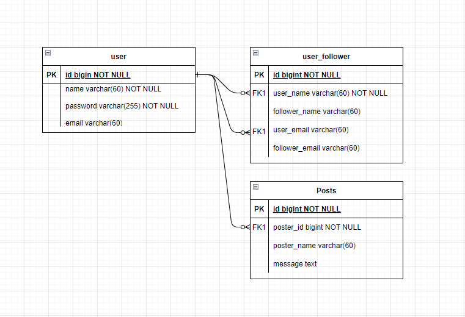
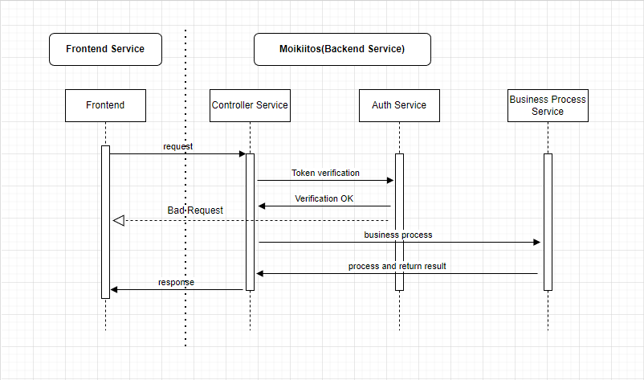
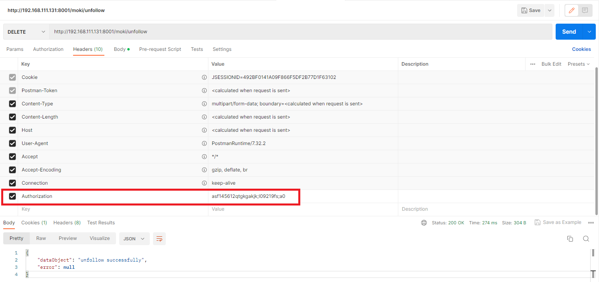

# MoiKiitos

Give some information about how Moikkiitos be designed and how it works
Also provides the guidance of how to download, compile and run the codes.


## 1. ER Diagram


## 2. Application sequence diagram


## 3. Instructions to run this application(linux based system)
### 3.1 build project
preconditions: Git, JDK and Maven were installed in host machine
1. in your working folder execute command: <br>
```git clone https://github.com/victor-kai/MoiKiitos.git && cd MoiKiitos```
2. execute command:<br>
```mvn install```
3. execute command:<br>
```mvn spring-boot:run` or `cd target && java -jar moikiitos-1.0-SNAPSHOT.jar```

### 3.2 Visit h2 database workbench: http://localhost:8001/h2-console

## 4. API list
| Function        | method | uri              |
|-----------------|--------|------------------|
| login           | POST   | /login           |
| register        | POST   | /register        |
| follow          | POST   | /moki/follow     |
| unfollow        | DELETE | /moki/unfollow   |
| list followers  | GET    | /moki/followers  |
| list followings | GET    | /moki/followings |
| find users      | GET    | /moki/users      |
| feed list       | GET    | /moki/feedlist   |
| post message    | POST   | /moki/post       |

## Note: When testing those APIs, token should be wrapped to request header
For security reason, engaged the token verification logic,
Due to limited time not implemented the jwt token generation and validation logic.<br>
headers - "Authorization":"asf145612qtgkgakjk;l09219fs;a0" <br>
like this: 